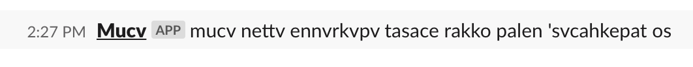

# /mucv

A slack command that returns the date in muscogee in the form of _day_of_week_ _month_ _cardinal_day_, i.e. Monday January 1st.

## Usage

From Slack type `/mucv` and the above is what will be printed back to you in Slack.

## Roadmap

- [x] Get project up and working on digital ocean
- [x] Use command in chat and return date in mvskoke
- [x] Allow the user to ask for more specific time if they want (i.e. `/mucv nettv`):
  - [x] nettv (day)
  - [x] hvse (month)
  - [ ] orolope (year)
- [ ] Add tests
- [ ] Get information about the Slack user and return a date relative to them as opposed to where the server is hosted

## References and Tools

- [Slack's Slash Commands](https://api.slack.com/interactivity/slash-commands) (for learning how slash commands work)
- [Ngrok](https://ngrok.com/) (for proxying a public ip to my `localhost` which helps with testing locally)
- [Setting up Ubuntu on Digital Ocean](https://www.digitalocean.com/community/tutorials/initial-server-setup-with-ubuntu-18-04) (server for hosting the application)
- [Setting up Nginx on Digital Ocean](https://www.digitalocean.com/community/tutorials/how-to-install-nginx-on-ubuntu-18-04) (web proxy that forwards public traffic to the application)
